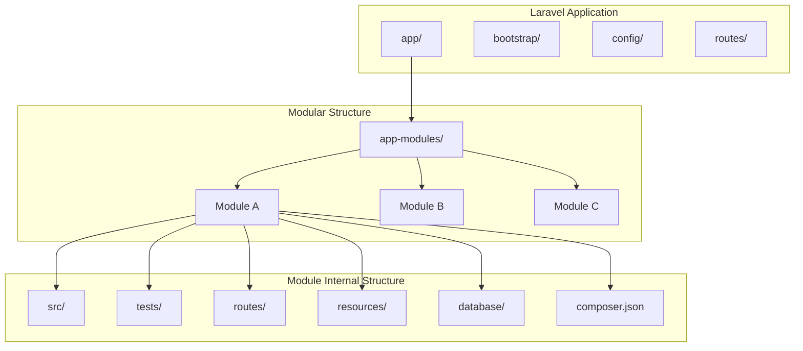
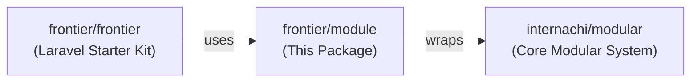
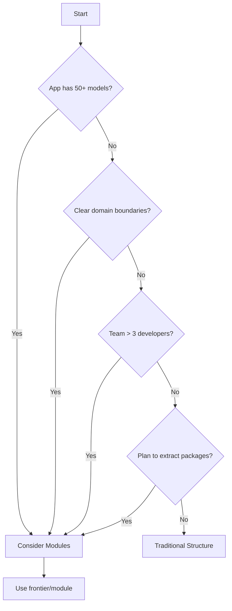

# Frontier Module - AI Guide

> **Comprehensive documentation for the `frontier/module` Laravel package**

## Overview

**Frontier Module** (`frontier/module`) is a companion package to the [Frontier Laravel Starter Kit](https://github.com/frontier/frontier) that provides modular application architecture. It wraps the powerful [`internachi/modular`](https://github.com/InterNACHI/modular) package to enable organizing large Laravel applications into self-contained, reusable modules.

### Key Benefits

| Benefit | Description |
|---------|-------------|
| **Organization** | Break large applications into logical, self-contained modules |
| **Reusability** | Modules can be extracted as separate Composer packages |
| **Laravel Conventions** | Follows standard Laravel patterns (unlike custom module systems) |
| **Auto-Discovery** | Commands, migrations, factories, policies, Blade components work automatically |
| **Familiar Tooling** | Uses standard `php artisan make:*` commands with `--module` flag |

---

## Architecture



### Package Relationship



---

## Core Components

### 1. ServiceProvider

The package's service provider (`Frontier\Modules\Providers\ServiceProvider`) integrates with Laravel's service container. It extends Illuminate's base ServiceProvider and relies on `internachi/modular` for the heavy lifting.

**Location:** [src/Providers/ServiceProvider.php](file:///var/www/html/rai/up/frontier-module/src/Providers/ServiceProvider.php)

### 2. Module Auto-Discovery

The underlying `internachi/modular` package provides:

- **Commands** → Auto-registered with Artisan
- **Migrations** → Run by the Migrator
- **Factories** → Auto-loaded for `factory()`
- **Policies** → Auto-discovered for Models
- **Blade Components** → Auto-discovered with namespace
- **Event Listeners** → Auto-discovered
- **Translations** → Auto-registered under module namespace

---

## Module Structure Convention

### Directory Layout

```
app-modules/
└── my-module/
    ├── composer.json           # Module's Composer configuration
    ├── src/
    │   ├── Models/             # Eloquent models
    │   ├── Http/
    │   │   ├── Controllers/    # HTTP controllers
    │   │   ├── Middleware/     # Module-specific middleware
    │   │   └── Requests/       # Form requests
    │   ├── Providers/          # Service providers
    │   ├── Console/
    │   │   └── Commands/       # Artisan commands
    │   ├── Jobs/               # Queue jobs
    │   ├── Events/             # Event classes
    │   ├── Listeners/          # Event listeners
    │   ├── Policies/           # Authorization policies
    │   ├── View/
    │   │   └── Components/     # Blade components
    │   └── Services/           # Business logic services
    ├── tests/
    │   ├── Feature/            # Feature tests
    │   └── Unit/               # Unit tests
    ├── routes/
    │   ├── web.php             # Web routes
    │   └── api.php             # API routes
    ├── resources/
    │   ├── views/              # Blade views
    │   ├── components/         # Anonymous Blade components
    │   └── lang/               # Translations
    │       └── en/
    │           └── messages.php
    └── database/
        ├── migrations/         # Database migrations
        ├── seeders/            # Database seeders
        └── factories/          # Model factories
```

### Namespace Convention

| Location | Namespace Pattern |
|----------|-------------------|
| Module Source | `Modules\{ModuleName}\*` |
| Controllers | `Modules\{ModuleName}\Http\Controllers` |
| Models | `Modules\{ModuleName}\Models` |
| Providers | `Modules\{ModuleName}\Providers` |
| Commands | `Modules\{ModuleName}\Console\Commands` |

> **Tip:** Customize the default namespace by publishing the config:
> ```bash
> php artisan vendor:publish --tag=modular-config
> ```

---

## Installation & Usage

### Installation

```bash
# Require the package
composer require frontier/module

# Laravel will auto-discover the service provider
```

### Creating a New Module

```bash
# Create a new module
php artisan make:module user-management

# Update Composer (required after creating modules)
composer update modules/user-management
```

This scaffolds:

```
app-modules/
└── user-management/
    ├── composer.json
    ├── src/
    ├── tests/
    ├── routes/
    ├── resources/
    └── database/
```

### Sync Configuration

```bash
# Sync project configs (phpunit.xml, PhpStorm settings)
php artisan modules:sync
```

---

## Code Examples

### Example 1: Module Service Provider Setup

```php
<?php

namespace Modules\UserManagement\Providers;

use Illuminate\Support\ServiceProvider;

class UserManagementServiceProvider extends ServiceProvider
{
    public function register(): void
    {
        // Bind interfaces to implementations
        $this->app->bind(
            \Modules\UserManagement\Contracts\UserRepositoryInterface::class,
            \Modules\UserManagement\Repositories\UserRepository::class
        );
    }

    public function boot(): void
    {
        // Register module-specific middleware
        $this->app['router']->aliasMiddleware(
            'user.verified',
            \Modules\UserManagement\Http\Middleware\EnsureUserVerified::class
        );
    }
}
```

### Example 2: Module Routes

**`app-modules/user-management/routes/api.php`**

```php
<?php

use Illuminate\Support\Facades\Route;
use Modules\UserManagement\Http\Controllers\UserController;
use Modules\UserManagement\Http\Controllers\ProfileController;

Route::prefix('api/users')->middleware(['api', 'auth:sanctum'])->group(function () {
    Route::get('/', [UserController::class, 'index']);
    Route::post('/', [UserController::class, 'store']);
    Route::get('/{user}', [UserController::class, 'show']);
    Route::put('/{user}', [UserController::class, 'update']);
    Route::delete('/{user}', [UserController::class, 'destroy']);
    
    Route::get('/profile', [ProfileController::class, 'show']);
    Route::put('/profile', [ProfileController::class, 'update']);
});
```

### Example 3: Module Controller

```php
<?php

namespace Modules\UserManagement\Http\Controllers;

use Illuminate\Http\JsonResponse;
use Modules\UserManagement\Http\Requests\CreateUserRequest;
use Modules\UserManagement\Models\User;
use Modules\UserManagement\Services\UserService;

class UserController
{
    public function __construct(
        private readonly UserService $userService
    ) {}

    public function index(): JsonResponse
    {
        $users = $this->userService->getAllUsers();
        
        return response()->json(['data' => $users]);
    }

    public function store(CreateUserRequest $request): JsonResponse
    {
        $user = $this->userService->createUser($request->validated());
        
        return response()->json(['data' => $user], 201);
    }

    public function show(User $user): JsonResponse
    {
        return response()->json(['data' => $user]);
    }
}
```

### Example 4: Module Model

```php
<?php

namespace Modules\UserManagement\Models;

use Illuminate\Database\Eloquent\Model;
use Illuminate\Database\Eloquent\Relations\HasMany;
use Modules\Orders\Models\Order; // Cross-module relation

class User extends Model
{
    protected $fillable = [
        'name',
        'email',
        'role',
    ];

    protected $casts = [
        'email_verified_at' => 'datetime',
    ];

    // Inter-module relationship
    public function orders(): HasMany
    {
        return $this->hasMany(Order::class);
    }
}
```

### Example 5: Inter-Module Communication

#### Option A: Direct Reference (Simple Cases)

```php
<?php

namespace Modules\Orders\Services;

use Modules\UserManagement\Models\User;
use Modules\Orders\Models\Order;

class OrderService
{
    public function createOrderForUser(User $user, array $data): Order
    {
        return $user->orders()->create($data);
    }
}
```

#### Option B: Contracts/Interfaces (Loose Coupling)

```php
<?php
// In UserManagement module
namespace Modules\UserManagement\Contracts;

interface UserRepositoryInterface
{
    public function find(int $id): ?object;
    public function findByEmail(string $email): ?object;
}
```

```php
<?php
// In Orders module - depends on contract, not implementation
namespace Modules\Orders\Services;

use Modules\UserManagement\Contracts\UserRepositoryInterface;

class OrderService
{
    public function __construct(
        private readonly UserRepositoryInterface $userRepository
    ) {}

    public function getOrdersForUserEmail(string $email): array
    {
        $user = $this->userRepository->findByEmail($email);
        return $user?->orders ?? [];
    }
}
```

#### Option C: Events (Fully Decoupled)

```php
<?php
// Module A dispatches event
namespace Modules\UserManagement\Services;

use Modules\UserManagement\Events\UserCreated;

class UserService
{
    public function createUser(array $data): User
    {
        $user = User::create($data);
        
        event(new UserCreated($user));
        
        return $user;
    }
}
```

```php
<?php
// Module B listens to event
namespace Modules\Notifications\Listeners;

use Modules\UserManagement\Events\UserCreated;

class SendWelcomeNotification
{
    public function handle(UserCreated $event): void
    {
        // Send welcome email/notification
    }
}
```

### Example 6: Blade Components

**`app-modules/dashboard/src/View/Components/StatCard.php`**

```php
<?php

namespace Modules\Dashboard\View\Components;

use Illuminate\View\Component;

class StatCard extends Component
{
    public function __construct(
        public string $title,
        public string|int $value,
        public ?string $icon = null
    ) {}

    public function render()
    {
        return view('dashboard::components.stat-card');
    }
}
```

**Usage in Blade:**

```blade
{{-- Use module-namespaced component --}}
<x-dashboard::stat-card 
    title="Total Users" 
    :value="$userCount" 
    icon="users" 
/>
```

### Example 7: Translations

**`app-modules/user-management/resources/lang/en/messages.php`**

```php
<?php

return [
    'welcome' => 'Welcome, :name!',
    'profile_updated' => 'Your profile has been updated.',
    'errors' => [
        'not_found' => 'User not found.',
        'unauthorized' => 'You are not authorized to perform this action.',
    ],
];
```

**Usage:**

```php
// Access translations with module namespace
__('user-management::messages.welcome', ['name' => $user->name]);

// In Blade
{{ __('user-management::messages.profile_updated') }}
```

---

## Artisan Commands

### Module Management Commands

| Command | Description |
|---------|-------------|
| `php artisan make:module <name>` | Create a new module |
| `php artisan modules:list` | List all registered modules |
| `php artisan modules:sync` | Sync project config (phpunit.xml, etc.) |
| `php artisan modules:cache` | Cache module discovery |
| `php artisan modules:clear` | Clear module cache |

### Laravel Make Commands with `--module`

All standard Laravel `make:*` commands support the `--module` option:

```bash
# Controllers
php artisan make:controller UserController --module=user-management

# Models
php artisan make:model User --module=user-management

# Migrations
php artisan make:migration create_users_table --module=user-management

# All other make commands
php artisan make:request CreateUserRequest --module=user-management
php artisan make:resource UserResource --module=user-management
php artisan make:policy UserPolicy --module=user-management
php artisan make:job ProcessUserImport --module=user-management
php artisan make:event UserCreated --module=user-management
php artisan make:listener SendWelcomeEmail --module=user-management
php artisan make:command ImportUsers --module=user-management
php artisan make:middleware EnsureUserVerified --module=user-management
php artisan make:factory UserFactory --module=user-management
php artisan make:seeder UserSeeder --module=user-management
php artisan make:test UserTest --module=user-management
```

### Database Commands with `--module`

```bash
# Run module seeder
php artisan db:seed --module=user-management

# Run specific seeder from module
php artisan db:seed --class=UserSeeder --module=user-management
```

### Livewire Support

```bash
# Create Livewire component in module
php artisan make:livewire UserList --module=user-management
```

---

## When to Use Modules vs Traditional Structure

### Use Modules When:

| Scenario | Why Modules Help |
|----------|------------------|
| **Large applications** (50+ models) | Better organization and discoverability |
| **Multiple domains** | Separate bounded contexts (users, orders, payments) |
| **Team development** | Teams can work on modules independently |
| **Potential extraction** | Module may become a separate package later |
| **Feature flags** | Easier to enable/disable entire features |
| **Different deployment cycles** | Modules can have independent versioning |

### Stick to Traditional Structure When:

| Scenario | Why Traditional Works |
|----------|----------------------|
| **Small applications** (< 20 models) | Overhead isn't worth it |
| **Simple CRUD apps** | No clear domain boundaries |
| **Solo development** | Personal preference matters more |
| **Rapid prototyping** | Speed over organization |
| **Tightly coupled features** | Everything interacts with everything |

### Decision Matrix



---

## Best Practices

### 1. Module Naming

```bash
# ✅ Good - Kebab-case, domain-focused
php artisan make:module user-access
php artisan make:module order-management
php artisan make:module payment-processing

# ❌ Avoid - Generic or technical names
php artisan make:module helpers
php artisan make:module utilities
php artisan make:module module1
```

### 2. Keep Modules Cohesive

A module should represent a single **bounded context**:

```
# ✅ Good - Single responsibility
app-modules/
├── user-access/        # Authentication, authorization
├── billing/            # Payments, invoices, subscriptions
└── notifications/      # Email, SMS, push notifications

# ❌ Avoid - Mixed responsibilities
app-modules/
└── core/               # Users AND payments AND notifications
```

### 3. Minimize Inter-Module Dependencies

```
# ✅ Good - Clear dependency direction
notifications → user-access (notifications depends on user-access)

# ❌ Avoid - Circular dependencies
user-access ↔ notifications (both depend on each other)
```

### 4. Use Contracts for Cross-Module Communication

```php
// ✅ Good - Depend on contracts
use Modules\UserAccess\Contracts\AuthServiceInterface;

// ❌ Avoid - Direct class dependencies between modules
use Modules\UserAccess\Services\AuthService;
```

### 5. Module-Specific Configuration

```php
// config/modules/user-access.php
return [
    'max_login_attempts' => 5,
    'lockout_duration' => 300,
];

// Access in module
config('modules.user-access.max_login_attempts');
```

---

## Extension & Customization

### Customizing Module Stubs

1. Publish the config:
   ```bash
   php artisan vendor:publish --tag=modular-config
   ```

2. Add custom stubs in the config file using placeholders:
   - `StubModuleNamespace` - Module namespace
   - `StubModuleName` - Module name
   - `StubClassNamePrefix` - Class prefix
   - `StubMigrationPrefix` - Migration timestamp

### Custom Namespace

Edit `config/app-modules.php`:

```php
return [
    'modules_namespace' => 'App\\Modules',  // Instead of 'Modules'
    'modules_path' => base_path('app-modules'),
];
```

### Adding Module-Specific Middleware

```php
// In module's ServiceProvider::boot()
$this->app['router']->aliasMiddleware(
    'module.custom',
    \Modules\MyModule\Http\Middleware\CustomMiddleware::class
);
```

### Module Discovery Caching

For production, cache module discovery:

```bash
# Add to deployment script
php artisan modules:cache
```

---

## Relationship to frontier/frontier

The `frontier/module` package is designed to work seamlessly with the **Frontier Laravel Starter Kit** (`frontier/frontier`). Together they provide:

| Package | Purpose |
|---------|---------|
| `frontier/frontier` | Core starter kit with auth, API, base structure |
| `frontier/module` | Modular architecture for organizing features |
| `frontier/action` | Action pattern for business logic |
| `frontier/repository` | Repository pattern for data access |

### Typical Setup

```json
{
    "require": {
        "frontier/frontier": "^1.0",
        "frontier/module": "^1.0",
        "frontier/action": "^1.0",
        "frontier/repository": "^1.0"
    }
}
```

---

## File Reference

| File | Purpose |
|------|---------|
| [composer.json](file:///var/www/html/rai/up/frontier-module/composer.json) | Package definition, dependencies |
| [src/Providers/ServiceProvider.php](file:///var/www/html/rai/up/frontier-module/src/Providers/ServiceProvider.php) | Laravel service provider |

### Dependencies

| Package | Version | Purpose |
|---------|---------|---------|
| `illuminate/support` | ^10.0 \| ^11.0 \| ^12.0 | Laravel support utilities |
| `internachi/modular` | ^2.0 | Core modular system |

---

## Quick Reference Card

```bash
# Create module
php artisan make:module my-module && composer update modules/my-module

# Generate components in module
php artisan make:model User --module=my-module
php artisan make:controller UserController --module=my-module
php artisan make:migration create_users_table --module=my-module

# List & manage modules
php artisan modules:list
php artisan modules:sync
php artisan modules:cache

# Access module resources
__('my-module::messages.key')     # Translations
<x-my-module::component />        # Blade components
```

---

## Additional Resources

- [InterNACHI Modular GitHub](https://github.com/InterNACHI/modular) - Core package documentation
- [Laravel Package Development](https://laravel.com/docs/packages) - Official Laravel docs
- [Domain-Driven Design](https://martinfowler.com/bliki/DomainDrivenDesign.html) - Architectural context

---

*This documentation is designed for both AI assistants and human developers working with the Frontier module system.*
